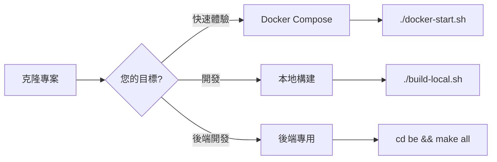
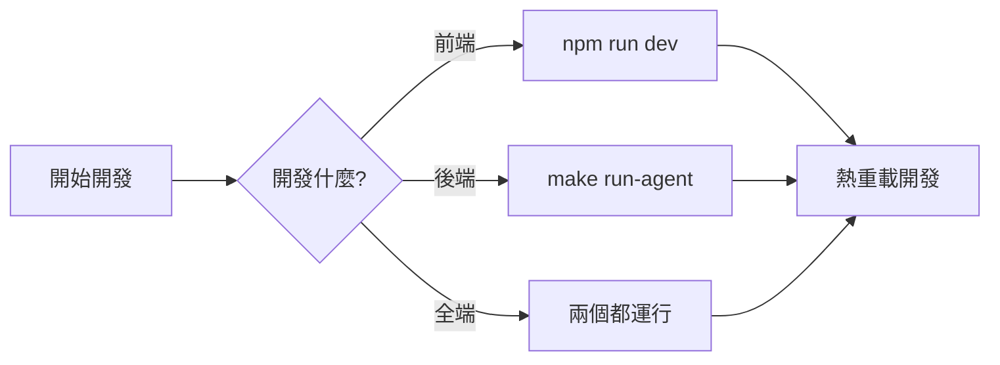

# Application/ 部署和啟動選項完整指南

> **版本**: v3.0.0  
> **更新**: 2025-10-09

---

## 🎯 三種主要啟動方式

Application/ 目錄支援三種完整的部署和啟動方式，可根據需求選擇：

---

## 方式 1: Docker Compose（容器化部署）⭐ 推薦

### 📦 特點
- ✅ **最簡單**: 一鍵啟動所有服務
- ✅ **最完整**: 11個服務全部包含
- ✅ **最隔離**: 容器化環境
- ✅ **最快速**: 2-5分鐘啟動

### 🏗️ 包含的服務（11個）

**核心**:
- pandora-agent (8080)
- axiom-ui (3001)

**監控**:
- prometheus (9090)
- grafana (3000)
- loki (3100)
- promtail
- alertmanager (9093)
- node-exporter (9100)

**資料**:
- postgres (5432)
- redis (6379)

**輔助**:
- nginx (80/443)

### 🚀 啟動步驟

#### Windows
```powershell
cd Application

# 1. 執行啟動腳本（會自動檢查 Docker 和創建 .env）
.\docker-start.ps1

# 2. 等待服務啟動（約30秒）

# 3. 訪問
# http://localhost:3001 - 主介面
# http://localhost:3000 - Grafana (admin/pandora123)
```

#### Linux/macOS
```bash
cd Application

# 1. 設定權限並啟動
chmod +x docker-start.sh
./docker-start.sh

# 2. 等待服務啟動

# 3. 訪問 http://localhost:3001
```

#### 手動方式
```bash
cd Application

# 1. 設定環境變數
cp .env.example .env
# 編輯 .env

# 2. 啟動
docker-compose up -d

# 3. 查看狀態
docker-compose ps

# 4. 查看日誌
docker-compose logs -f
```

### 🛑 停止服務
```bash
docker-compose down              # 停止並移除容器
docker-compose down -v           # 同時刪除資料卷
docker-compose stop              # 只停止，保留容器和資料
```

### 📊 管理命令
```bash
docker-compose ps                # 查看狀態
docker-compose logs -f           # 查看所有日誌
docker-compose logs -f pandora-agent  # 查看特定服務
docker-compose restart           # 重啟所有服務
docker-compose restart pandora-agent  # 重啟特定服務
docker-compose build             # 重新構建映像
```

---

## 方式 2: 本地構建（二進位部署）

### 📦 特點
- ✅ **最靈活**: 完全自訂編譯選項
- ✅ **最高效**: 原生效能，無容器開銷
- ✅ **最適合開發**: 快速迭代
- ✅ **最輕量**: 只需要必要的二進位檔案

### 🛠️ 前置需求
- Go 1.24+
- Node.js 18+
- PostgreSQL 14+（需手動安裝）
- Redis 7+（需手動安裝）

### 🚀 啟動步驟

#### Windows
```powershell
cd Application

# 1. 執行構建（會編譯前後端）
.\build-local.ps1 -Version "3.0.0"

# 2. 進入構建產物目錄
cd dist

# 3. 啟動所有服務
.\start.bat

# 4. 訪問 http://localhost:3001
```

#### Linux/macOS
```bash
cd Application

# 1. 執行構建
chmod +x build-local.sh
./build-local.sh all "3.0.0"

# 2. 進入構建產物目錄
cd dist

# 3. 啟動所有服務
chmod +x start.sh
./start.sh

# 4. 訪問 http://localhost:3001
```

### 📂 構建產物結構
```
dist/
├── backend/
│   ├── pandora-agent.exe (或無副檔名)
│   ├── pandora-console.exe
│   ├── axiom-ui.exe
│   └── configs/          # 配置檔案
├── frontend/
│   ├── .next/            # Next.js 輸出
│   └── public/           # 靜態資源
├── start.bat / start.sh  # 啟動腳本（自動生成）
├── stop.bat / stop.sh    # 停止腳本（自動生成）
└── README.txt            # 使用說明（自動生成）
```

### 🛑 停止服務

#### Windows
```powershell
.\stop.bat
```

#### Linux/macOS
```bash
./stop.sh
```

### 🔧 開發模式

只構建後端（快速迭代）:
```bash
cd Application/be
make all
make run-agent
```

只構建前端（快速迭代）:
```bash
cd Application/Fe
npm run dev  # 開發模式，支援熱重載
```

---

## 方式 3: 後端專用構建（開發專用）

### 📦 特點
- ✅ **最精簡**: 只編譯 Go 程式
- ✅ **最快速**: 跳過前端構建
- ✅ **最適合後端開發**: 專注 Go 開發

### 🚀 啟動步驟

#### 使用 Makefile（Linux/macOS）
```bash
cd Application/be

# 查看所有可用命令
make help

# 顯示配置資訊
make info

# 編譯所有程式
make all

# 或分別編譯
make agent
make console
make ui

# 編譯並運行
make run-agent
make run-console
make run-ui
```

#### 使用構建腳本
```powershell
# Windows
cd Application\be
.\build.ps1

# Linux/macOS
cd Application/be
chmod +x build.sh
./build.sh
```

#### 直接使用 Go
```bash
# 在專案根目錄
cd <project_root>

# 編譯 Agent
go build -o Application/be/bin/pandora-agent ./cmd/agent/main.go

# 編譯 Console
go build -o Application/be/bin/pandora-console ./cmd/console/main.go

# 編譯 UI
go build -o Application/be/bin/axiom-ui ./cmd/ui/main.go

# 運行
Application/be/bin/pandora-agent --config configs/agent-config.yaml
```

---

## 📊 方式對照表

| 特性 | Docker Compose | 本地構建 | 後端專用 |
|------|----------------|----------|----------|
| **啟動時間** | 2-5分鐘 | 5-10分鐘 | 1-2分鐘 |
| **難度** | ⭐ 簡單 | ⭐⭐ 中等 | ⭐⭐ 中等 |
| **依賴** | Docker | Go+Node+DB | Go+DB |
| **服務數量** | 11個全部 | 3個核心 | 1-3個 |
| **適合場景** | 測試、演示、快速部署 | 開發、生產 | 後端開發 |
| **資源隔離** | ✅ 完全隔離 | ❌ 共享系統 | ❌ 共享系統 |
| **效能** | ⚠️ 有開銷 | ✅ 最佳 | ✅ 最佳 |
| **可移植性** | ⭐⭐⭐⭐⭐ | ⭐⭐⭐ | ⭐⭐⭐ |

---

## 🤔 如何選擇？

### 選擇 Docker Compose，如果您：
- ✅ 想要快速體驗完整系統
- ✅ 需要所有監控服務（Prometheus, Grafana等）
- ✅ 不想手動安裝依賴
- ✅ 需要隔離的測試環境
- ✅ 準備部署到生產環境

### 選擇本地構建，如果您：
- ✅ 正在開發前端或後端
- ✅ 需要快速迭代和測試
- ✅ 想要最佳效能
- ✅ 需要自訂編譯選項
- ✅ 已經有運行的 PostgreSQL 和 Redis

### 選擇後端專用，如果您：
- ✅ 只開發後端 Go 程式
- ✅ 不需要前端
- ✅ 想要最快的編譯速度
- ✅ 進行 Go 程式碼調試

---

## 💡 混合使用

您也可以混合使用！

### 範例：Docker 基礎設施 + 本地應用

```bash
# 1. 用 Docker 運行基礎服務
cd Application
docker-compose up postgres redis prometheus grafana loki -d

# 2. 本地開發前端
cd Fe
npm run dev  # http://localhost:3001

# 3. 本地開發後端
cd ../be
make run-agent  # 連接到 Docker 的資料庫
```

### 範例：Docker 全部 + 本地前端開發

```bash
# 1. Docker 運行所有後端和監控
cd Application
docker-compose up -d
docker-compose stop axiom-ui  # 停止前端容器

# 2. 本地運行前端（開發模式）
cd Fe
npm run dev  # 熱重載，快速開發
```

---

## 📝 快速參考

### 最快啟動（給使用者）
```bash
cd Application && ./docker-start.sh
```
**結果**: 完整系統運行，訪問 http://localhost:3001

### 快速開發（給開發者）
```bash
# 前端
cd Application/Fe && npm run dev

# 後端
cd Application/be && make run-agent
```
**結果**: 開發模式，支援熱重載

### 完整構建（給部署者）
```bash
cd Application && ./build-local.sh
```
**結果**: dist/ 包含所有可部署的二進位檔案

---

## 🎯 推薦流程

### 第一次使用



### 日常開發



---

## ✅ 總結

Application/ 現在提供**靈活且完整**的啟動選項：

| 方式 | 命令 | 時間 | 適合 |
|------|------|------|------|
| **Docker** | `./docker-start.sh` | 2分鐘 | 測試、演示、生產 |
| **本地構建** | `./build-local.sh` | 5分鐘 | 開發、自訂部署 |
| **後端專用** | `cd be && make all` | 1分鐘 | 後端開發 |

**加上混合模式**，實際上有更多的靈活組合！

---

**維護**: Pandora Security Team  
**最後更新**: 2025-10-09

