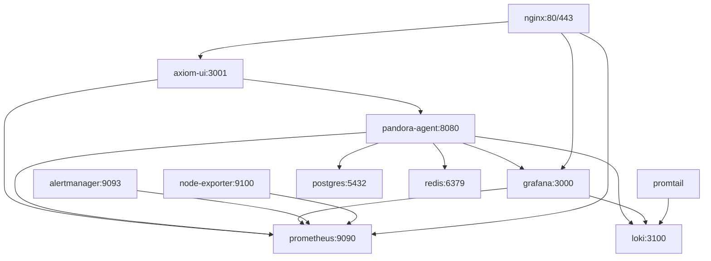

# Application/ Docker 架構說明

> **版本**: v3.0.0  
> **更新**: 2025-10-09

---

## 🏗️ 完整服務架構

Application/ 現在包含**完整的容器化地端部署方案**，包含 11 個服務。

---

## 📊 服務清單

### 核心服務（2個）

| 服務 | Dockerfile | 端口 | 說明 |
|------|------------|------|------|
| **pandora-agent** | agent.dockerfile | 8080 | 主要 Agent 程式 |
| **axiom-ui** | ui.patr.dockerfile | 3001 | Web UI 伺服器 |

### 監控服務（5個）

| 服務 | 映像 | 端口 | 說明 |
|------|------|------|------|
| **prometheus** | prom/prometheus:v2.47.0 | 9090 | 指標收集與儲存 |
| **grafana** | grafana/grafana:10.2.0 | 3000 | 視覺化儀表板 |
| **loki** | grafana/loki:2.9.2 | 3100 | 日誌聚合 |
| **promtail** | grafana/promtail:2.9.2 | - | 日誌收集器 |
| **alertmanager** | prom/alertmanager:v0.26.0 | 9093 | 告警管理 |

### 資料服務（2個）

| 服務 | 映像 | 端口 | 說明 |
|------|------|------|------|
| **postgres** | postgres:15-alpine | 5432 | 關聯式資料庫 |
| **redis** | redis:7.2-alpine | 6379 | 快取與會話 |

### 輔助服務（2個）

| 服務 | 映像 | 端口 | 說明 |
|------|------|------|------|
| **nginx** | nginx:1.25-alpine | 80, 443 | 反向代理 |
| **node-exporter** | prom/node-exporter:v1.6.1 | 9100 | 系統指標 |

**總計**: 11 個服務

---

## 🔗 服務依賴關係



---

## 🚀 啟動方式

### 方式 1: 使用啟動腳本（推薦）

**Windows**:
```powershell
.\docker-start.ps1
```

**Linux/macOS**:
```bash
chmod +x docker-start.sh
./docker-start.sh
```

### 方式 2: 直接使用 docker-compose

```bash
# 啟動所有服務
docker-compose up -d

# 查看狀態
docker-compose ps

# 查看日誌
docker-compose logs -f

# 停止所有服務
docker-compose down
```

---

## 🌐 訪問 URL

啟動後可訪問：

| 服務 | URL | 帳號 |
|------|-----|------|
| **主介面** | http://localhost:3001 | - |
| **Grafana** | http://localhost:3000 | admin / pandora123 |
| **Prometheus** | http://localhost:9090 | - |
| **AlertManager** | http://localhost:9093 | - |
| **Loki** | http://localhost:3100 | - |

---

## 📦 映像構建

### 自動構建（docker-compose）

```bash
docker-compose build
```

### 手動構建特定服務

```bash
# 構建 Agent
docker build -f docker/agent.dockerfile -t pandora-agent:latest ..

# 構建 UI
docker build -f docker/ui.patr.dockerfile -t axiom-ui:latest ..
```

---

## 🔧 配置管理

### 環境變數

1. 複製範例：
   ```bash
   cp .env.example .env
   ```

2. 編輯 `.env` 設定：
   - 資料庫密碼
   - Redis 密碼
   - 裝置端口
   - 日誌等級

### 配置檔案位置

所有配置檔案引用自 `../configs/`：
- `../configs/agent-config.yaml`
- `../configs/prometheus/prometheus.yml`
- `../configs/grafana/`
- 等等

---

## 💾 資料持久化

Docker Compose 使用以下 volumes：

| Volume | 用途 |
|--------|------|
| `pandora-data` | Agent 資料 |
| `prometheus-data` | Prometheus 時序資料 |
| `loki-data` | Loki 日誌資料 |
| `grafana-data` | Grafana 儀表板 |
| `alertmanager-data` | AlertManager 狀態 |
| `postgres-data` | PostgreSQL 資料庫 |
| `redis-data` | Redis 資料 |

---

## 🔍 服務健康檢查

所有服務都配置了健康檢查：

```bash
# 檢查所有服務健康狀態
docker-compose ps

# 檢查特定服務日誌
docker-compose logs -f pandora-agent
docker-compose logs -f axiom-ui
```

---

## 🎯 完整部署架構

```
Application/ (Docker Compose 編排)
│
├── 前端層
│   ├── axiom-ui (3001)          → Next.js UI
│   └── nginx (80/443)           → 反向代理
│
├── 後端層
│   └── pandora-agent (8080)     → 主要 Agent
│
├── 監控層
│   ├── prometheus (9090)        → 指標收集
│   ├── grafana (3000)           → 視覺化
│   ├── loki (3100)              → 日誌聚合
│   ├── promtail                 → 日誌收集
│   ├── alertmanager (9093)      → 告警管理
│   └── node-exporter (9100)     → 系統指標
│
└── 資料層
    ├── postgres (5432)          → 資料庫
    └── redis (6379)             → 快取
```

---

## 📝 與本地構建的區別

| 項目 | Docker Compose | 本地構建 |
|------|----------------|----------|
| **部署方式** | 容器化 | 二進位檔案 |
| **依賴管理** | 自動（映像內） | 手動安裝 |
| **啟動方式** | docker-compose up | ./start.bat/.sh |
| **適用場景** | 快速部署、測試 | 開發、自訂 |
| **資源隔離** | ✅ 完全隔離 | ❌ 共享系統 |
| **可移植性** | ✅ 高 | ⚠️ 中 |

---

## 🤔 選擇哪種方式？

### 使用 Docker Compose，如果您：
- ✅ 想要快速部署
- ✅ 需要隔離環境
- ✅ 有 Docker 環境
- ✅ 不想手動安裝依賴

### 使用本地構建，如果您：
- ✅ 需要自訂編譯選項
- ✅ 想要最佳效能
- ✅ 進行開發工作
- ✅ 不想使用 Docker

---

**維護**: Pandora Security Team  
**最後更新**: 2025-10-09

