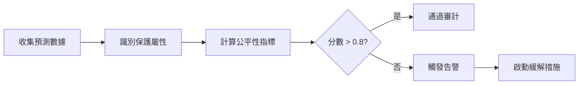

# AI 治理最佳實踐

> **版本**: 3.2.0  
> **服務**: Cyber AI/Quantum Security  
> **完成日期**: 2025-01-14

---

## 📋 概述

本文檔提供 Pandora Box Console IDS-IPS 的 AI 治理最佳實踐，確保 AI 模型的安全性、公平性、可靠性和合規性。

---

## 🎯 治理原則

### 1. 安全第一 (Security First)

- ✅ 模型完整性驗證
- ✅ 對抗性攻擊防禦
- ✅ 模型中毒檢測
- ✅ 訪問控制和審計

### 2. 公平性 (Fairness)

- ✅ 無偏差決策
- ✅ 公平性審計
- ✅ 多元化訓練數據
- ✅ 定期評估

### 3. 可解釋性 (Explainability)

- ✅ 決策過程透明
- ✅ 特徵重要性分析
- ✅ 預測理由說明
- ✅ 人工審核機制

### 4. 問責制 (Accountability)

- ✅ 完整的審計日誌
- ✅ 版本控制
- ✅ 變更追蹤
- ✅ 責任歸屬

### 5. 隱私保護 (Privacy)

- ✅ 數據匿名化
- ✅ 差分隱私
- ✅ 聯邦學習
- ✅ GDPR 合規

---

## 🔍 模型完整性

### SHA-256 哈希驗證

#### 流程

```python
# 1. 註冊模型
model_hash = sha256(model_weights).hexdigest()
registry[model_id] = model_hash

# 2. 定期驗證
current_hash = sha256(current_model).hexdigest()
if current_hash != registered_hash:
    alert("模型可能被篡改！")
```

#### 最佳實踐

- ✅ **初始註冊**: 部署時立即註冊模型
- ✅ **定期驗證**: 每小時驗證一次
- ✅ **變更追蹤**: 記錄所有驗證結果
- ✅ **自動告警**: 完整性失敗立即通知

### 數位簽章

```python
# 使用私鑰簽名模型
signature = sign(model_data, private_key)

# 使用公鑰驗證
is_valid = verify(model_data, signature, public_key)
```

---

## ⚖️ 公平性審計

### 評估指標

#### 1. 人口統計平等性 (Demographic Parity)

```python
# 定義：不同群組的正預測率應該相等
P(Ŷ=1 | A=0) ≈ P(Ŷ=1 | A=1)

# 計算
parity_score = 1 - |positive_rate_group0 - positive_rate_group1|
```

#### 2. 機會均等性 (Equal Opportunity)

```python
# 定義：不同群組的真陽性率應該相等
P(Ŷ=1 | Y=1, A=0) ≈ P(Ŷ=1 | Y=1, A=1)

# 計算
equality_score = 1 - |TPR_group0 - TPR_group1|
```

#### 3. 預測平等性 (Predictive Equality)

```python
# 定義：不同群組的假陽性率應該相等
P(Ŷ=1 | Y=0, A=0) ≈ P(Ŷ=1 | Y=0, A=1)
```

### 審計流程



### 緩解策略

#### 重新權重

```python
# 為少數群組增加權重
class_weights = {
    'majority': 1.0,
    'minority': 2.0
}
```

#### 重新採樣

```python
# 過採樣少數群組
minority_samples = oversample(minority_data, factor=2)
balanced_data = majority_data + minority_samples
```

#### 後處理

```python
# 調整決策閾值
if protected_group:
    threshold = 0.45  # 降低閾值
else:
    threshold = 0.50  # 標準閾值
```

---

## 🛡️ 對抗性防禦

### 攻擊類型

| 攻擊 | 描述 | 防禦 |
|------|------|------|
| FGSM | 快速梯度符號法 | 對抗訓練 |
| PGD | 投影梯度下降 | 輸入驗證 |
| C&W | Carlini-Wagner | 集成模型 |
| DeepFool | 最小擾動 | 梯度遮蔽 |

### 防禦策略

#### 1. 輸入驗證

```python
def validate_input(data):
    # 檢查範圍
    if np.any((data < -3) | (data > 3)):
        return False, "輸入超出正常範圍"
    
    # 檢查梯度
    gradients = np.diff(data)
    if np.any(np.abs(gradients) > 2):
        return False, "檢測到異常梯度"
    
    return True, "OK"
```

#### 2. 對抗訓練

```python
# 在訓練時加入對抗樣本
adversarial_samples = generate_adversarial(clean_samples)
training_data = clean_samples + adversarial_samples
```

#### 3. 集成防禦

```python
# 多模型投票
predictions = [model1.predict(x), model2.predict(x), model3.predict(x)]
final_prediction = majority_vote(predictions)
```

---

## 📊 性能監控

### 關鍵指標

| 類別 | 指標 | 目標值 | 告警閾值 |
|------|------|--------|---------|
| 準確性 | Accuracy | > 95% | < 90% |
| | Precision | > 94% | < 88% |
| | Recall | > 93% | < 87% |
| | F1 Score | > 94% | < 88% |
| 性能 | Latency | < 50ms | > 100ms |
| | Throughput | > 1000 req/s | < 500 req/s |
| | CPU Usage | < 50% | > 80% |
| | Memory | < 2GB | > 4GB |
| 可靠性 | Uptime | > 99.9% | < 99% |
| | Error Rate | < 1% | > 5% |

### 監控儀表板

```python
# Prometheus 指標
model_accuracy = Gauge('ml_model_accuracy', 'Model accuracy')
model_latency = Histogram('ml_prediction_latency_seconds', 'Prediction latency')
model_requests = Counter('ml_requests_total', 'Total requests')
model_errors = Counter('ml_errors_total', 'Total errors')
```

---

## 📋 合規性清單

### GDPR 合規

- ✅ **資料最小化**: 只收集必要數據
- ✅ **目的限制**: 數據只用於聲明目的
- ✅ **準確性**: 確保數據準確且最新
- ✅ **存儲限制**: 定期清理過期數據
- ✅ **完整性和保密性**: 加密和訪問控制
- ✅ **問責制**: 完整審計日誌

### AI 倫理準則

- ✅ **透明度**: 公開 AI 使用情況
- ✅ **公平性**: 無歧視決策
- ✅ **可解釋性**: 可以解釋決策
- ✅ **人工監督**: 關鍵決策人工審核
- ✅ **安全性**: 防止濫用和攻擊

---

## 🔧 實施建議

### 開發階段

1. **設計審查**: AI 倫理委員會審查
2. **數據審計**: 檢查訓練數據偏差
3. **測試**: 包含公平性和對抗性測試
4. **文檔**: 完整的模型卡和數據表

### 部署階段

1. **註冊**: 註冊模型和元數據
2. **基線**: 建立性能基線
3. **監控**: 啟動持續監控
4. **告警**: 配置告警規則

### 運營階段

1. **定期審計**: 每季度公平性審計
2. **性能評估**: 每月性能評估
3. **安全檢查**: 每週完整性檢查
4. **更新**: 按需重新訓練和更新

---

## 📚 參考資料

### 標準和框架

- **ISO/IEC 42001**: AI Management System
- **EU AI Act**: 歐盟 AI 法規
- **NIST AI RMF**: AI Risk Management Framework

### 工具和庫

- **AI Fairness 360**: IBM 公平性工具包
- **Foolbox**: 對抗性攻擊庫
- **MLflow**: ML 生命週期管理

---

**維護者**: Pandora AI Governance Team  
**最後更新**: 2025-01-14  
**版本**: 3.2.0

