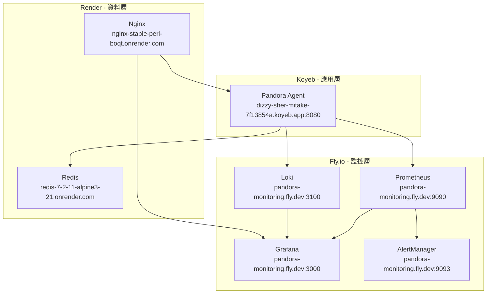

# PaaS 平台整合指南

本文檔說明如何整合分散在不同 PaaS 平台上的 Pandora Box Console IDS/IPS 服務。

---

## 🌐 當前部署架構



---

## 📋 服務清單

| 服務 | 平台 | URL | 用途 | 狀態 |
|------|------|-----|------|------|
| **Pandora Agent** | Koyeb | `https://dizzy-sher-mitake-7f13854a.koyeb.app:8080` | 主要應用程式 | ✅ 運行中 |
| **Prometheus** | Fly.io | `https://pandora-monitoring.fly.dev:9090` | 指標收集 | ✅ 運行中 |
| **Grafana** | Fly.io | `https://pandora-monitoring.fly.dev:3000` | 監控儀表板 | ✅ 運行中 |
| **Loki** | Fly.io | `https://pandora-monitoring.fly.dev:3100` | 日誌聚合 | ✅ 運行中 |
| **AlertManager** | Fly.io | `https://pandora-monitoring.fly.dev:9093` | 告警管理 | ✅ 運行中 |
| **Redis** | Render | `https://redis-7-2-11-alpine3-21.onrender.com` | 快取系統 | ✅ 運行中 |
| **Nginx** | Render | `https://nginx-stable-perl-boqt.onrender.com` | 反向代理 | ✅ 運行中 |

---

## 🔧 整合步驟

### 步驟 1: 更新 Koyeb Agent 環境變數

在 Koyeb 控制台中設定以下環境變數：

```bash
# 監控服務
PROMETHEUS_URL=https://pandora-monitoring.fly.dev:9090
GRAFANA_URL=https://pandora-monitoring.fly.dev:3000
LOKI_URL=https://pandora-monitoring.fly.dev:3100
ALERTMANAGER_URL=https://pandora-monitoring.fly.dev:9093

# 資料服務
REDIS_URL=redis://redis-7-2-11-alpine3-21.onrender.com:6379
REDIS_PASSWORD=${REDIS_PASSWORD}

# 應用設定
LOG_LEVEL=info
ENVIRONMENT=production
```

#### Koyeb 設定方式：

1. 登入 Koyeb Dashboard
2. 選擇 `pandora-agent` 服務
3. 點擊 **Settings** → **Environment Variables**
4. 添加上述環境變數
5. 點擊 **Deploy** 重新部署

### 步驟 2: 配置 Prometheus 抓取 Koyeb Agent

更新 Fly.io 上的 Prometheus 配置：

```yaml
# configs/prometheus/prometheus.yml
scrape_configs:
  - job_name: 'pandora-agent'
    static_configs:
      - targets: ['dizzy-sher-mitake-7f13854a.koyeb.app:8080']
    metrics_path: '/metrics'
    scheme: 'https'
    tls_config:
      insecure_skip_verify: true
```

#### 更新方式：

```bash
# 1. 更新本地配置文件
vim configs/prometheus/prometheus.yml

# 2. 重新部署 Fly.io 監控棧
flyctl deploy --app pandora-monitoring \
  --config deployments/paas/flyio/fly-monitoring.toml \
  --dockerfile build/docker/monitoring.dockerfile
```

### 步驟 3: 配置 Loki 接收 Koyeb 日誌

在 Koyeb Agent 中配置 Promtail 將日誌發送到 Fly.io Loki：

```yaml
# configs/promtail-paas.yaml
clients:
  - url: https://pandora-monitoring.fly.dev:3100/loki/api/v1/push
    tls_config:
      insecure_skip_verify: true

scrape_configs:
  - job_name: system
    static_configs:
      - targets:
          - localhost
        labels:
          job: pandora-agent
          platform: koyeb
          __path__: /var/log/*.log
```

### 步驟 4: 配置 Nginx 反向代理

更新 Render 上的 Nginx 配置以代理所有服務：

```nginx
# configs/nginx/nginx-paas.conf
upstream pandora_agent {
    server dizzy-sher-mitake-7f13854a.koyeb.app:8080;
}

upstream grafana {
    server pandora-monitoring.fly.dev:3000;
}

upstream prometheus {
    server pandora-monitoring.fly.dev:9090;
}

server {
    listen 80;
    server_name nginx-stable-perl-boqt.onrender.com;

    # Pandora Agent API
    location /api/ {
        proxy_pass https://pandora_agent;
        proxy_set_header Host $host;
        proxy_set_header X-Real-IP $remote_addr;
        proxy_set_header X-Forwarded-For $proxy_add_x_forwarded_for;
        proxy_set_header X-Forwarded-Proto $scheme;
    }

    # Grafana Dashboard
    location /grafana/ {
        proxy_pass https://grafana/;
        proxy_set_header Host $host;
        proxy_set_header X-Real-IP $remote_addr;
    }

    # Prometheus Metrics
    location /prometheus/ {
        proxy_pass https://prometheus/;
        proxy_set_header Host $host;
        proxy_set_header X-Real-IP $remote_addr;
    }

    # Health Check
    location /health {
        return 200 "OK\n";
        add_header Content-Type text/plain;
    }
}
```

### 步驟 5: 配置 Grafana 資料源

在 Grafana 中添加資料源：

1. **訪問 Grafana**: `https://pandora-monitoring.fly.dev:3000`
2. **登入**: 使用預設帳號 `admin` / `pandora123`
3. **添加 Prometheus 資料源**:
   - Name: `Prometheus`
   - URL: `http://localhost:9090`
   - Access: `Server (default)`
4. **添加 Loki 資料源**:
   - Name: `Loki`
   - URL: `http://localhost:3100`
   - Access: `Server (default)`

### 步驟 6: 驗證整合

執行以下命令驗證服務整合：

```bash
# 1. 檢查 Koyeb Agent 健康狀態
curl https://dizzy-sher-mitake-7f13854a.koyeb.app:8080/health

# 2. 檢查 Prometheus 是否抓取到 Agent 指標
curl https://pandora-monitoring.fly.dev:9090/api/v1/targets

# 3. 檢查 Grafana 是否可訪問
curl https://pandora-monitoring.fly.dev:3000/api/health

# 4. 檢查 Loki 是否正常
curl https://pandora-monitoring.fly.dev:3100/ready

# 5. 檢查 Redis 連接
redis-cli -h redis-7-2-11-alpine3-21.onrender.com -p 6379 ping

# 6. 檢查 Nginx 代理
curl https://nginx-stable-perl-boqt.onrender.com/health
```

---

## 🔐 安全設定

### 1. 設定 HTTPS

所有服務都應使用 HTTPS：

- ✅ Koyeb: 自動提供 HTTPS
- ✅ Fly.io: 自動提供 HTTPS
- ✅ Render: 自動提供 HTTPS

### 2. 配置防火牆規則

在 Koyeb 中限制訪問：

```yaml
# koyeb.yaml
services:
  - name: pandora-agent
    env:
      - ALLOWED_ORIGINS=https://pandora-monitoring.fly.dev,https://nginx-stable-perl-boqt.onrender.com
```

### 3. 設定 Redis 密碼

在 Render Redis 中啟用密碼保護：

1. 登入 Render Dashboard
2. 選擇 Redis 服務
3. 設定 `REDIS_PASSWORD` 環境變數
4. 在 Koyeb Agent 中更新 `REDIS_PASSWORD`

### 4. 配置 Grafana 認證

更改 Grafana 預設密碼：

```bash
# 使用 Fly.io SSH 連接
flyctl ssh console --app pandora-monitoring

# 在容器內執行
grafana-cli admin reset-admin-password <NEW_PASSWORD>
```

---

## 📊 監控儀表板設定

### 導入預建儀表板

1. **登入 Grafana**: `https://pandora-monitoring.fly.dev:3000`
2. **導入儀表板**:
   - 點擊 **+** → **Import**
   - 上傳 `configs/grafana/dashboards/*.json`
3. **配置變數**:
   - 設定 `instance` 變數為 `dizzy-sher-mitake-7f13854a.koyeb.app:8080`

### 建立告警規則

在 Grafana 中設定告警：

```yaml
# configs/prometheus/rules/alerts.yml
groups:
  - name: pandora_alerts
    interval: 30s
    rules:
      - alert: PandoraAgentDown
        expr: up{job="pandora-agent"} == 0
        for: 1m
        labels:
          severity: critical
        annotations:
          summary: "Pandora Agent is down"
          description: "Koyeb Agent has been down for more than 1 minute"

      - alert: HighErrorRate
        expr: rate(pandora_errors_total[5m]) > 0.05
        for: 5m
        labels:
          severity: warning
        annotations:
          summary: "High error rate detected"
          description: "Error rate is {{ $value }} errors/sec"
```

---

## 🔄 自動化部署

### 使用 GitHub Actions

更新 `.github/workflows/deploy-paas.yml` 以自動部署到所有平台：

```yaml
# 部署到 Koyeb 後自動更新配置
- name: Update Koyeb Environment Variables
  run: |
    koyeb service update pandora-agent/pandora-agent \
      --env PROMETHEUS_URL=https://pandora-monitoring.fly.dev:9090 \
      --env GRAFANA_URL=https://pandora-monitoring.fly.dev:3000 \
      --env LOKI_URL=https://pandora-monitoring.fly.dev:3100 \
      --env REDIS_URL=redis://redis-7-2-11-alpine3-21.onrender.com:6379

# 部署到 Fly.io 後自動更新 Prometheus 配置
- name: Update Prometheus Targets
  run: |
    flyctl ssh console --app pandora-monitoring -C "
      echo 'Updating Prometheus configuration...'
      # 重新載入配置
      kill -HUP \$(pidof prometheus)
    "
```

---

## 🧪 測試整合

### 端到端測試腳本

```bash
#!/bin/bash
# scripts/test/test-paas-integration.sh

echo "🧪 測試 PaaS 服務整合..."

# 1. 測試 Koyeb Agent
echo "1️⃣ 測試 Koyeb Agent..."
curl -f https://dizzy-sher-mitake-7f13854a.koyeb.app:8080/health || exit 1

# 2. 測試 Prometheus
echo "2️⃣ 測試 Prometheus..."
curl -f https://pandora-monitoring.fly.dev:9090/-/healthy || exit 1

# 3. 測試 Grafana
echo "3️⃣ 測試 Grafana..."
curl -f https://pandora-monitoring.fly.dev:3000/api/health || exit 1

# 4. 測試 Loki
echo "4️⃣ 測試 Loki..."
curl -f https://pandora-monitoring.fly.dev:3100/ready || exit 1

# 5. 測試 Nginx
echo "5️⃣ 測試 Nginx..."
curl -f https://nginx-stable-perl-boqt.onrender.com/health || exit 1

echo "✅ 所有服務整合測試通過！"
```

---

## 📝 故障排除

### 問題 1: Prometheus 無法抓取 Koyeb Agent 指標

**症狀**: Prometheus targets 顯示 `down`

**解決方案**:
```bash
# 1. 檢查 Koyeb Agent 是否暴露 /metrics 端點
curl https://dizzy-sher-mitake-7f13854a.koyeb.app:8080/metrics

# 2. 檢查 Prometheus 配置
flyctl ssh console --app pandora-monitoring
cat /etc/prometheus/prometheus.yml

# 3. 重新載入 Prometheus 配置
kill -HUP $(pidof prometheus)
```

### 問題 2: Loki 無法接收 Koyeb 日誌

**症狀**: Grafana 中看不到 Koyeb 的日誌

**解決方案**:
```bash
# 1. 檢查 Promtail 配置
# 在 Koyeb 容器中
cat /etc/promtail/config.yml

# 2. 檢查 Promtail 狀態
supervisorctl status promtail

# 3. 重啟 Promtail
supervisorctl restart promtail
```

### 問題 3: Redis 連接失敗

**症狀**: Koyeb Agent 無法連接 Redis

**解決方案**:
```bash
# 1. 檢查 Redis 是否運行
curl https://redis-7-2-11-alpine3-21.onrender.com

# 2. 檢查 Redis 密碼
# 在 Koyeb 環境變數中確認 REDIS_PASSWORD

# 3. 測試連接
redis-cli -h redis-7-2-11-alpine3-21.onrender.com -a $REDIS_PASSWORD ping
```

### 問題 4: Nginx 代理失敗

**症狀**: 通過 Nginx 訪問服務返回 502

**解決方案**:
```bash
# 1. 檢查 Nginx 日誌
# 在 Render Dashboard 中查看日誌

# 2. 檢查上游服務狀態
curl https://dizzy-sher-mitake-7f13854a.koyeb.app:8080/health
curl https://pandora-monitoring.fly.dev:3000/api/health

# 3. 重新部署 Nginx
# 在 Render Dashboard 中手動重新部署
```

---

## 💰 成本優化

| 平台 | 服務 | 預估月費 | 優化建議 |
|------|------|----------|----------|
| Koyeb | Agent | $5-10 | 使用 Nano 實例 |
| Fly.io | Monitoring | $3 | 已優化至 3GB volume |
| Render | Redis + Nginx | $7 | 使用免費層級 |
| **總計** | - | **$15-20** | - |

---

## 📚 相關文檔

- [Koyeb 部署指南](./koyeb/README.md)
- [Fly.io Volume 調整](../operations/FLYIO-VOLUME-FIX.md)
- [Render 服務配置](./render/README.md)
- [監控設定指南](../operations/monitoring-setup.md)

---

## ✅ 整合檢查清單

- [ ] Koyeb Agent 環境變數已設定
- [ ] Prometheus 已配置抓取 Koyeb Agent
- [ ] Loki 已配置接收 Koyeb 日誌
- [ ] Nginx 反向代理已配置
- [ ] Grafana 資料源已添加
- [ ] 所有服務健康檢查通過
- [ ] 監控儀表板已導入
- [ ] 告警規則已設定
- [ ] 自動化部署已配置
- [ ] 端到端測試通過

---

**維護者**: DevOps Team  
**最後更新**: 2025-10-08  
**狀態**: ✅ 生產就緒
